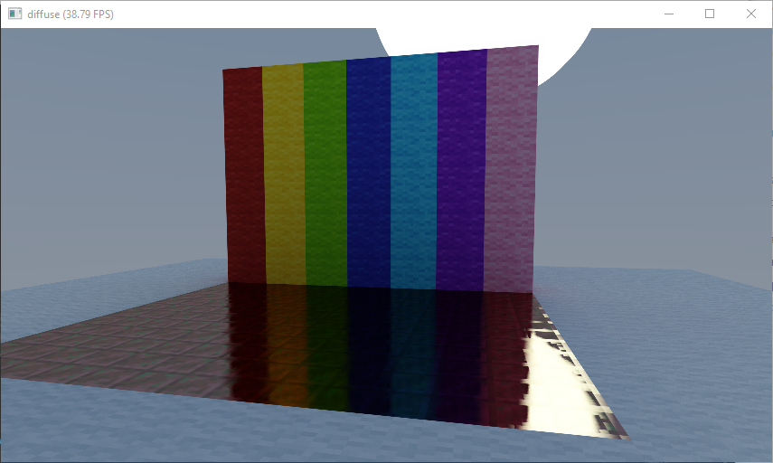

# mcpt - (Realtime) Minecraft Path Tracer

This is the main repo for the mcpt project, a realtime path tracer for Minecraft. Please note that the current codebase is monolithic and might not adhere to best practices in code organization (its a mess and total garbage). It is primarily a proof of concept at this stage, and several features are currently missing.

## Prerequisites

To run mcpt, you will need the following prerequisites:

- Taichi 
- Python
- Pillow (PIL)
- requests (for communication with Minecraft)
- a Graphics Card

To enable mcpt to gather real-time data from Minecraft, you need to install a compatible Minecraft mod. This mod creates an interface through which mcpt can communicate with Minecraft.



## Usage

To run mcpt, use the following command:

```python
python mcpt.py
```

Make sure Minecraft is running with the mod installed and active in the background. The mod should expose the necessary server for mcpt to connect to and fetch the current player coordinates and world data.

## Configuration

You can customize the parameters defined in the `mcpt.py` file to adjust the behavior of the path tracer. Note that performance and rendering results depend on these settings.

## License

This project is licensed under the MIT License. For more information, please see the LICENSE file.

## Authors

- 0skxr
